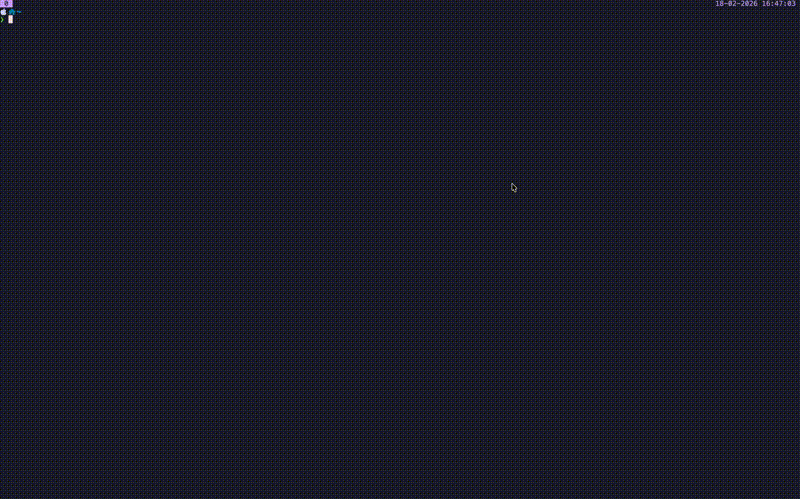

# fzf-music

A terminal-based music playlist browser that uses `fzf` to select and play local `.m3u` playlists with cover art previews.



## Features

- Browse `.m3u` playlists with `fzf`
- Preview cover art in the terminal (Kitty graphics protocol or chafa fallback)
- Toggle between cover art and track list previews (`ctrl-i` / `ctrl-t`)
- Multi-monitor support — choose which screen to play on
- Plays fullscreen and shuffled via `mpv`

## Prerequisites

Playlists are expected as `.m3u` files under `PLAYLIST_DIR` (default is `~/Music/local/playlists`). Each playlist directory can include a `cover.*` image (e.g. `cover.jpg`, `cover.png`) for artwork previews.

```
~/Music/local/playlists/
├── album-a/
│   ├── album-a.m3u
│   └── cover.jpg
└── album-b/
    ├── album-b.m3u
    └── cover.png
```

## Dependencies

| Tool                                                          | Purpose                                |
| ------------------------------------------------------------- | -------------------------------------- |
| [fzf](https://github.com/junegunn/fzf)                        | Fuzzy finder for playlist selection    |
| [mpv](https://mpv.io/)                                        | Media player                           |
| [chafa](https://hpjansson.org/chafa/)                         | Terminal image rendering (fallback)    |
| [displayplacer](https://github.com/jakehilborn/displayplacer) | Multi-monitor screen selection (macOS) |

Optional: [Kitty](https://sw.kovidgoyal.net/kitty/) terminal for higher quality image previews via `kitten icat`.

## Installation

### Install dependencies (macOS)

```sh
brew install fzf mpv chafa displayplacer
```

### Install the script

Clone the repo and add it to your `PATH`:

```sh
git clone https://github.com/jacoboneill/fzf-music ~/.local/share/fzf-music
ln -s ~/.local/share/fzf-music/fzf-music ~/.local/bin/fzf-music
```

Or copy it directly:

```sh
cp fzf-music ~/.local/bin/fzf-music
chmod +x ~/.local/bin/fzf-music
```

Make sure `~/.local/bin` is in your `PATH`.

## Usage

```sh
fzf-music
```

1. If multiple monitors are detected, select a screen.
2. Browse and select a playlist from the fzf picker.
3. Use `ctrl-t` to preview the track list and `ctrl-i` to show the cover art.
4. Press `Enter` to play the selected playlist fullscreen in `mpv` (shuffled, looping).
